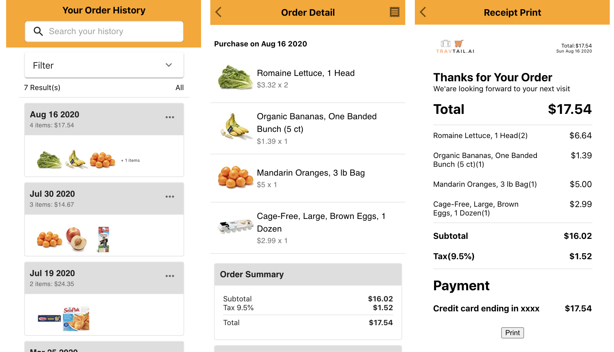
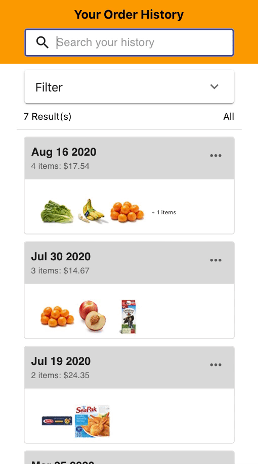

## Receipt demo
This is a mobile-based receipts page demo, including 3 pages: Order history, Order detail, Print detail.



### Usage
- Run in localhost:
  ```
  # clone the git repo
  npm install
  npm start
  ```
- Live application (Heroku deployment):
https://receipt-demo-nan.herokuapp.com/

### Features
* User can apply date filters to display their receipts in specific time range

  

* User can search their receipts based on product name

  

* User can check detail receipts and get print-friendly version
  
    


### Notes：
* App created by `create-react-app`
* To open live application, it might take some time due to heroku limitation
* Items' name, price and images are taken from Amazon, for demo usage ONLY
* The data is hard-code, however, `getOrder...()` mimic the API call that return the data from back end
* For simplicity, date filters take some common filters (e.g. a week, a month, by year), it can easily extend to specified time range search
* For Safari, browser print window will close in 5s, because Safari choose no to block the code after `window.print()`, see implement in `OrderPrint` for detail
* This demo was created in hurry, might no meet best practice in some code, as well as no well documented. This demo is `Mobile-base`, might look awkward from desktop browser